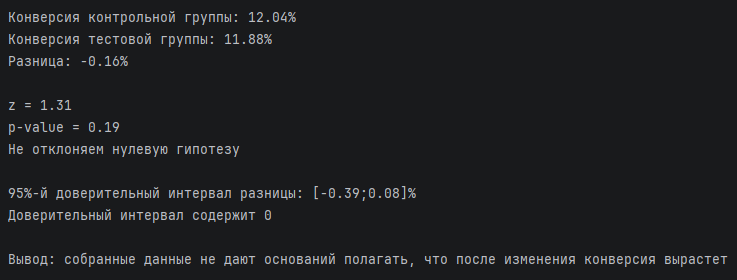

# Анализ результатов A/B-тестирования

В исходном датасете находятся результаты А/В-тестирования, проведённого интернет-магазином. Компания разработала новую веб-страницу, чтобы попытаться увеличить конверсию. Требуется провести анализ полученных данных и сделать вывод, следует ли внедрить изменение в продукт.

Датасет: https://www.kaggle.com/datasets/zhangluyuan/ab-testing

Я рассчитал конверсию для контрольной и тестовой групп и сравнил их, затем проверил статистическую значимость результатов при помощи проверки статистических гипотез и расчёта доверительного интервала.

Решение на Python находится в файле **ab-testing.py**. Для обработки датасета использовал pandas, для статистического анализа использовал statsmodels.

Вывод программы:

